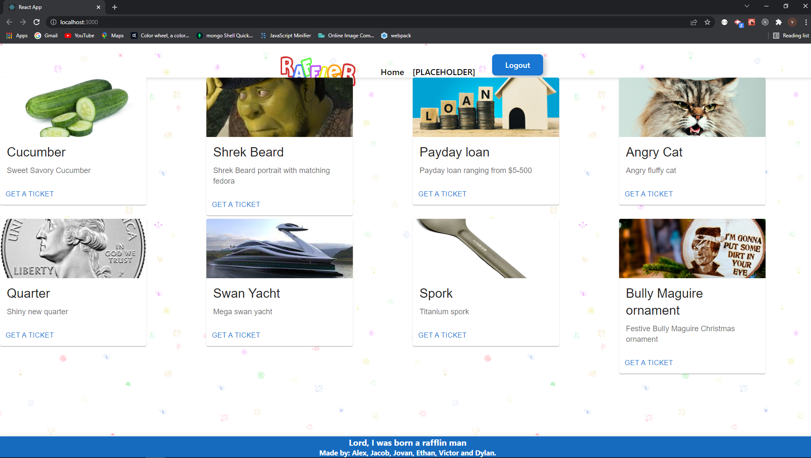

# The Raffler 

[The Raffler](https://the-raffler.herokuapp.com/)

## Application Description
The Raffler! \
\
The online raffle where you can purchase digital raffle tickets to win all kinds of prizes. It's socially distanced, it's environmentally responsible, and you can support great causes no matter where you are!

## Table of Contents
* [Description](#application-description)
* [Installation](#installation)
* [Usage](#usage)
* [License](#license)
* [Contributions](#contributions)
* [Testing](#testing)
* [Questions](#questions)

## Installation
Use npm install to install packages.

## Usage
Free to use.

## License
N/A

## Contributions
You can contribute by creating a new issue.\
\
Built by [Alex](https://github.com/alexchristianson), [Jacob](https://github.com/JacobRyanHanson), [Jovan](https://github.com/Jovan-png), [Ethan](https://github.com/ethanfregien2233), [Dylan](https://github.com/dylan-fair), and [Victor](https://github.com/vic-smith).

## Testing
N/A

## Questions
Please feel free to reach out through GitHub with any questions or concerns.

